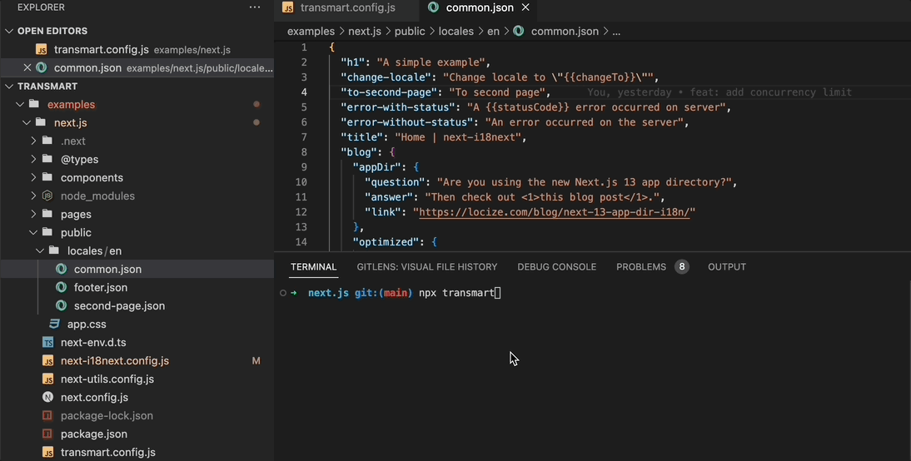

# Transmart


> Automate your i18n localization with AI.




Transmart is an open-source developer tool that utilizes ChatGPT to automate i18n translation. Given a base language and specifying all the languages that need to be output, running it will generate all i18n locale files.

It consists of two parts: Cli and Core. Core is the NodeJS core implementation of Transmart, while Cli is a command-line tool that encapsulates Core. In most cases, only Cli is used.

## Features

- [x] Supports Large file sizes，don't worry about the 4096 tokens limit
- [x] Supports all languages that ChatGPT can be displayed using [Intl.DisplayNames](https://developer.mozilla.org/en-US/docs/Web/JavaScript/Reference/Global_Objects/Intl/DisplayNames/DisplayNames) and can be processed by ChatGPT.
- [x] Supports [i18next](https://www.i18next.com/)
- [ ] Supports [vue-i18n](https://kazupon.github.io/vue-i18n/)
- [x] Supports [Chrome.i18n](https://developer.chrome.com/docs/webstore/i18n/#choosing-locales-to-support)
- [ ] Supports iOS
- [ ] Supports Android
- [ ] Supports custom locale file structure


## Setup

> Transmart requires Node version 13 or higher.

### 1. Installation
To install Transmart, run:


```sh
npm install @transmart/cli -D

# or

yarn add @transmart/cli
```

### 2. Project setup

First, create a transmart.config.js file in the root of your project. or any others file format [cosmiconfig](https://www.npmjs.com/package/cosmiconfig?activeTab=readme) can search for

`transmart.config.js`

```js
module.exports = {
  baseLocale: "en",
  locales: ["fr", "jp", "de"],
  localePath: "public/locales",
  openAIApiKey: "your-own-openai-api-key",
};

```


### 3. Start translation.

Add transmart command to your npm scripts

```sh
{
  "translate": "transmart"
} 
```

And then execute

```sh
npm run translate
```

Or you can execute directly with `npx` prefix in command line

```
npx transmart
```

🎉🎉 Enjoy Coding! 


## Examples

- [next.js](./examples/next)
- [chrome extension](./examples/chrome-extension/)

## Cli options

Here are all the available options for CLI.  Running `npx transmart -h` will display them.

Tips: Using command line options while using transmart.config.js will override the options in transmart.config.js.

```sh
Usage: transmart [options]

🚀 Automate your i18n localization with AI.
  
 Example: 

 npx transmart (transmart.config.js must be present)
  
 Or more verbose way: 

 npx transmart -b en-US -p public/locales -l zh-CN,jp,de -k <your-own-openai-api-key>

Options:
  -c, --config <configurationFile>         transmart.config.js or transmartrc.json whatever config file format which cosmiconfig supports
  -b, --base-locale <baseLocale>           the language that Transmart will use as a reference to translate other target languages
  -l, --locales <locales...>               all the languages that need to be translated (including baseLocale which is also acceptable)
  -p, --locale-path <localePath>           where you store your locale files
  -k, --openai-api-key <openAIApiKey>      the OpenAI API Key. For instructions on how to obtain a key, please refer to: https://gptforwork.com/setup/how-to-create-openai-api-key
  --openai-api-url <openAIApiUrl>          OpenAI API base url, useful when using proxy
  --openai-api-urlpath <openAIApiUrlPath>  OpenAI API url endpoint, which is useful when using proxy
  -V, --version                            output the version number
  -h, --help                               display help for command
```


## Contributing

To contribute to Transmart，refer to [contributing.md](./CONTRIBUTING.md)


## Inspired by

- https://chatgpt-i18n.vercel.app/
- https://twitter.com/forgebitz/status/1634100746617597955
